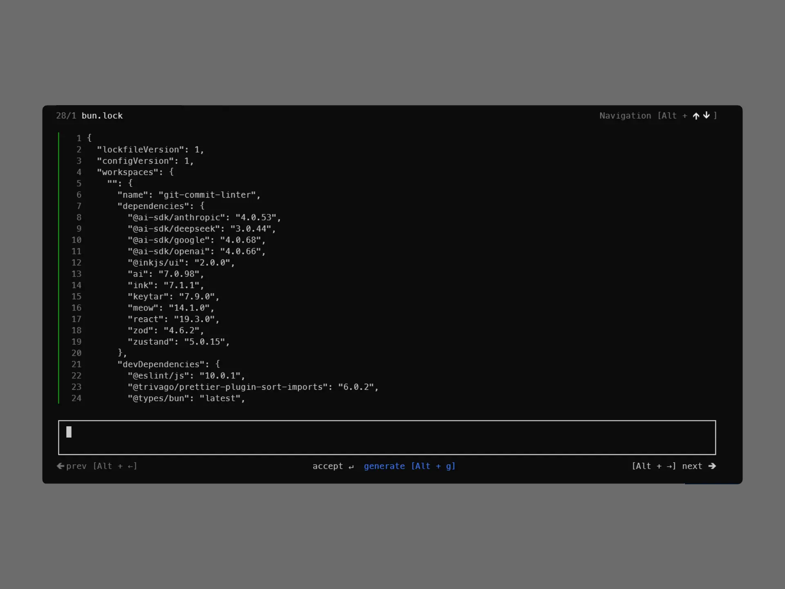

<h1 align="center">
  <br>
  <a href="https://github.com/Eze-sk"></a>
  <br>
     AI Commit CLI (cli-cmt-git)
  <br>
</h1>

<h4 align="center">
   An AI-powered CLI & TUI assistant for generating smart Git commit messages from your terminal.
</h4>

<div align="center">


</div>



## Features & Modes

* **Interactive TUI:** Run `cli-cmt-git` for a guided, visual interface.
* **Direct Commands:** Run `cli-cmt-git commit` for fast shell automation.
* **Smart AI:** Generates commit messages from all staged changes or specific files.

## Quick Start

```bash
# Set up API key
cli-cmt-git config --set-key "your-api-key-here"

# Run TUI or generate commit directly
cli-cmt-git
cli-cmt-git commit --all
## Notes

- The default entrypoint opens the TUI when no command is provided.
- `commit` can operate on staged changes or a specific file path.
- `config` is used to manage AI service credentials and related settings.
- This project is still best used as a local developer utility for generating commit message suggestions.
```

### CLI Reference

```bash
cli-cmt-git                         # Launch interactive TUI
cli-cmt-git commit [--all | <file>] # Generate commit message
cli-cmt-git config --set-key <key>  # Save AI API key
cli-cmt-git --help                  # View all options
```

### Local Development

```bash
bun install    # Install dependencies
bun run dev    # Start dev mode
bun run build  # Build project
```

## Credits

Developed by <a href="https://github.com/Eze-sk">ezesk </a>

This project is licensed under the GNU General Public License v2.0 (GPL-2.0).
